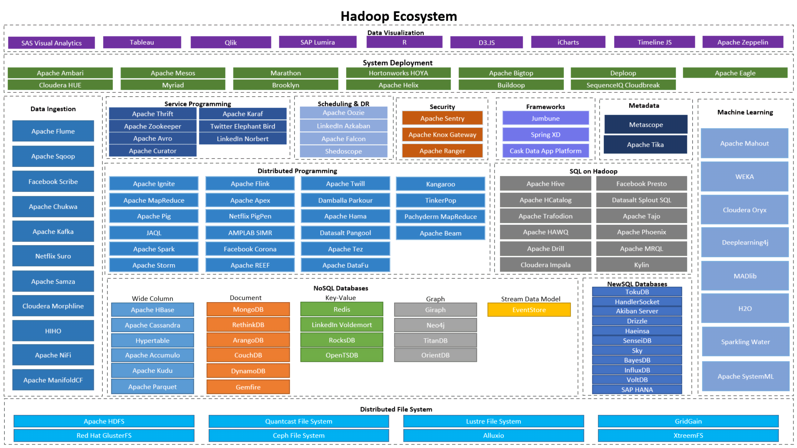
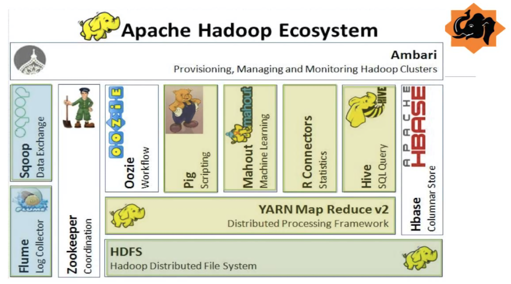

# [Hadoop](https://hadoop.apache.org/releases.html)

<!-- TOC -->

- [Hadoop](#hadoop)
    - [Hadoop生态系统](#hadoop生态系统)
    - [[Hadoop入门几个题]](#hadoop入门几个题)
    - [[HDFS入门几个题]](#hdfs入门几个题)
    - [[MapReduce入门几个题]](#mapreduce入门几个题)
    - [[YARN入门几个题]](#yarn入门几个题)
    - [[Hadoop优化几个题]](#hadoop优化几个题)

<!-- /TOC -->
---
## Hadoop生态系统

[Hadoop Ecosystem参考](https://data-flair.training/blogs/hadoop-ecosystem/)



**精简一下**



**部分技术名词解释** 

- HDFS：(Hadoop Distributed File System)数据存储
- YARN：(Yet Another Resource Manager)Hadoop资源管理
- MapReduce：分布式运算编程框架
- Hive:数据仓库项目，它提供数据查询和分析
- Zookeeper：协调Hadoop生态系统中的各个服务；节省了同步、配置维护、分组和命名所需的时间
- Flume：一个帮助将结构化和半结构化数据导入HDFS的服务。
- Kafka：一种高吞吐量的分布式发布订阅消息系统
- Spark：当前最流行的开源大数据内存计算框架。可以基于Hadoop上存储的大数据进行计算。
- Sqoop：一个从外部资源导入数据到兼容的Hadoop生态系统组件，如HDFS、Hive、HBase等。
- Oozie：一个用于管理Hadoop作业的工作流调度程序系统。它支持Hadoop作业用于Map-Reduce、Pig、Hive和Sqoop。
- Hbase：一个构建在HDFS之上的NoSQL数据库

------

  ## Hadoop概述

  ### 	是什么
> ​	***“Hadoop is a technology to store massive datasets on a cluster of cheap machines in a distributed manner”***——*Doug Cutting and Mike Cafarella*

  ### 	什么用

- 存储大量的数据
- 处理不同格式的数据
- 高速生成数据

## [Hadoop入门几个题](data/几个题.md)

- 简单描述如何安装配置Apache的一个开源Hadoop

- Hadoop中需要哪些配置文件，作用是什么

- 正常工作额Hadoop集群中要分别启动哪些进程，它们的作用是什么

- 简述Hadoop的几个默认端口及其含义

-----

## [HDFS入门几个题](data/几个题.md)

- HDFS读写流程

- SecondaryNameNode工作机制

- NameNode和SecondaryNameNode区别与联系

- 服役新数据节点和退役旧数据节点步骤

  

  ### 是什么
  
  - HDFS(Hadoop Distributed File System)
  
    分布式文件存储系统，通过目录树定位文件。具有高容错，处理数据量大等优点；适合一次写入多次读出的大数据分析场景。
  
  ### HDFS组成架构
  
  
  
  - NameNode
  
    它也称为Master Node。NameNode不存储实际数据或数据集。NameNode存储元数据，即块的数量、位置、存储在哪个机架上、数据存储在哪个Datanode上以及其他细节。它由文件和目录组成。
  
    1. 管理HDFS命名空间
    2. 配置副本策略
    3. 管理数据块（block）映射信息
    4. 处理客户端读写请求
  
  - DataNode
  
    它也被称为Salave Node。Datanode负责在HDFS中存储实际数据。
  
    1. DataNode根据NameNode的指令执行诸如创建块副本、删除和复制等操作。
    2. 存储实际数据
  
  - Secondary NameNode
  
    1. 辅助NameNode工作定期合并fsimage和edits，并发送给NameNode
    2. 在紧急情况下可以辅助恢复NameNode
  
  ### HDFS shell操作
  
  - Hadoop集群启动 
  
    ```
    start-dfs.sh
    # 在配置有yarn的机器启动yarn
    start-yarn.sh
    ```
  
  - 显式目录信息
  
    ```
    hadoop fs -ls /path
    ```
  
  - 在HDFS上创建目录
  
    ```
    hadoop fs -mkdir -p /dir1/dir2
    ```
  
  - 显示文件内容
  
    ```
    hadoop fs -cat /dir/file.txt
    ```
  
  - 修改HDFS上文件权限
  
    ```
    # 修改所属的组	-chgrp
    hadoop fs -chgrp -R hadoop /dir/file  # 修改/dir/file及其子目录下的所有文件用户组为hadoop
    # 修改文件权限	-chmod
    # 修改文件所属	-chown
    ```
  
  - 下载HDFS文件到本地
  
    ```
    hadoop fs -get /dir/file.txt /mydir/myDocument
    ```
  
  - 上传文件到HDFS
  
    ```
    hadoop fs -put /mydir/myDocument/remote.txt /hdfsdir/dir
    ```
  
  - 从HDFS一个路径拷贝文件到另一个路径
  
    ```
    hadoop fs -cp /sanguo/shuguo/kongming.txt /zhuge.txt
    ```
  
  - 在HDFS目录中移动文件
  
    ```
    hadoop fs -mv /zhuge.txt /sanguo/shuguo/
    ```
  
  - 删除HDFS上文件
  
    ```
    hadoop fs -rm /user/atguigu/test/jinlian2.txt
    ```
  
  - 删除空目录
  
    ```
    hadoop fs -rmdir /test
    ```
  
  - 统计文件夹大小信息
  
    ```
    hadoop fs -du -s -h /user/atguigu/test
    ```
  
  - 设置HDFS文件副本数
  
    ```
    hadoop fs -setrep 10 /sanguo/shuguo/kongming.txt
    ```

------


## [MapReduce入门几个题](data/几个题.md)

- 谈谈Hadop序列化和反序列化以及自定义bean对象实现序列化

- FileInputFormat切片机制

- 自定义InputFormat流程

- 如何决定一个job的map和reduce数量

- MapTask的个数由什么决定

- MapTask工作机制

- ReduceTask工作机制

- 简述MapReduce有几种排序，执行几次，发生在什么阶段

- 简述Mapreduce中的shuffle阶段工作流程，如何优化shuffle阶段

- 简述MapReduce中combiner作用，一般使用场景，哪些情况不需要使用，以及和Reduce的区别

- 简述MapReduce工作原理，

- 如果没有定义partitioner，数据在被送到Reduce之前如何被分区

- MapReduce的TopN

- Hadoop任务能输出到多个目录中吗？如果可以怎么做？

- 简述Hadoop实现join的集中方法，每种方法的实现方法

- 简述Hadoop实现二级排序

- 简述Hadoop中RecordReader作用


### Mapreduce 是什么

​	MapReduce是Hadoop生态系统的核心组件，它提供数据处理。MapReduce是一个软件框架，用于轻松编写处理Hadoop分布式文件系统中存储的大量结构化和非结构化数据的应用程序。

**特点**

1. 易于编程

   提供了很多接口供一些编程语言使用，如Java，python和C++

2. 良好的扩展性

   当计算资源得不到满足的时候可以通过简单的增加机器来扩展计算能力

3. 高容错性

   当一台机器挂了可以把计算任务转移到另一个节点上运行

4. 处理数据量大

   可以实现上千台服务器集群并发工作，提供数据处理能力。

### MapReduce 进程

1. AppMaster：负责整个程序的过程调度和状态协调
2. MapTask：负责Map阶段
3. ReduceTas：负责Reduce阶段

------

## [YARN入门几个题](data/几个题.md#YARN入门几个题)

- Hadoop1.X和Hadoop2.X架构的异同

- 为什么会产生YARN，它解决什么问题，优势是什么

- MapReduce作业提交全过程

- HDFS数据压缩算法

- Hadoop的调度器总结

- MapReduce推测执行算法及原理

  

----
## [Hadoop优化几个题](data/几个题.md)
- MapReduce跑的慢的原因
- MapReduce优化方法
- HDFS小文件的优化方法
- MapReduce解决数据均衡的几个方法，如何确定分区号
- Hadoop中job和Task的区别

