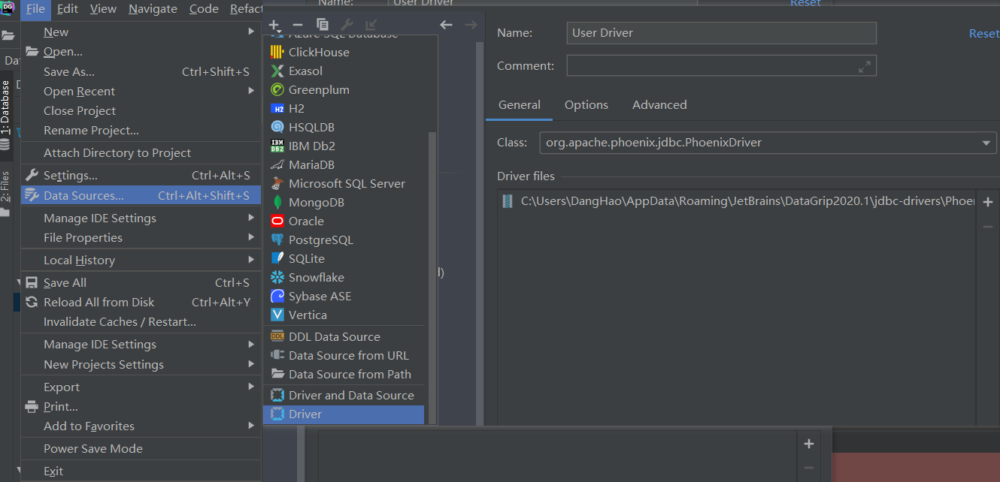
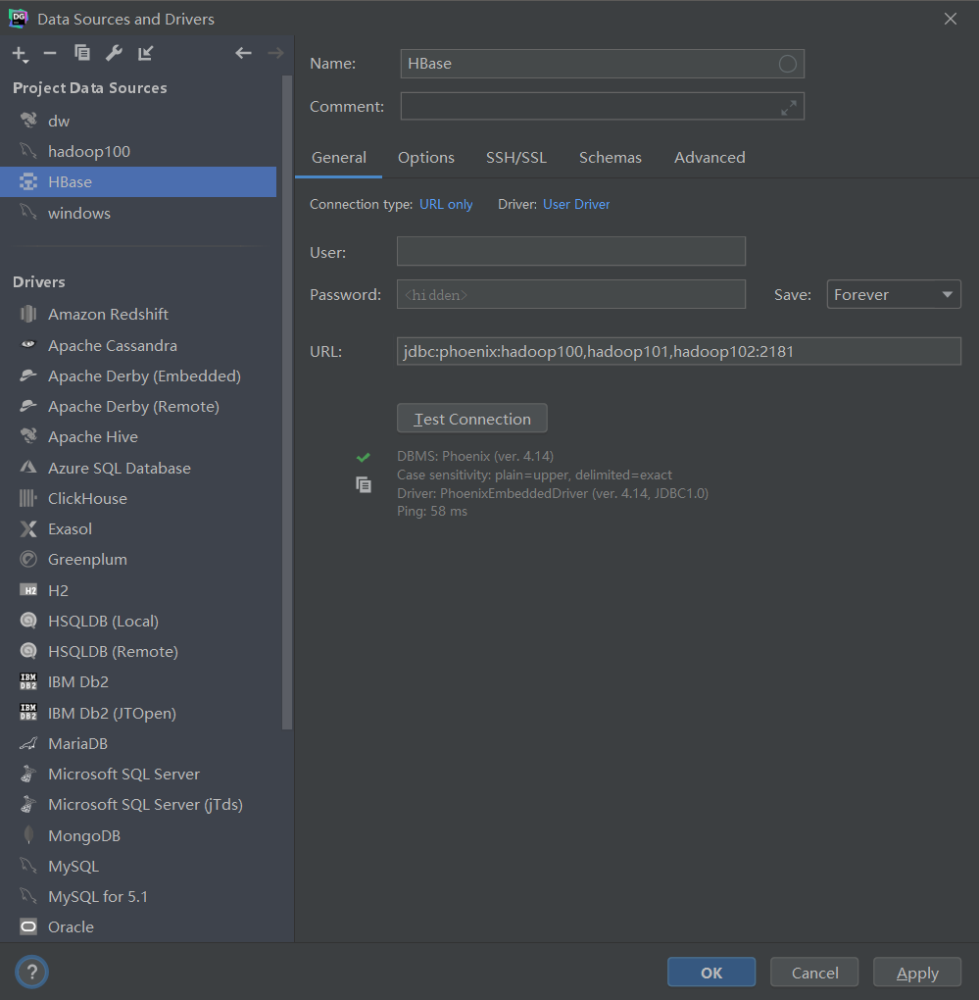

# Phoenix

## 简介

## 部署

- [下载]( http://phoenix.apache.org/index.html)安装包，注意和`HBase`版本对应

- 解压安装包到指定目录，并将Phoenix目录下`server`和`client`的jar包复制到`HBase\lib`，并**分发到其他节点**

- 添加Phoenix的bin目录到环境变量

- 启动`Hadoop`、`Zookeeper`和`Hbase`

- 启动Phoenix

  ```bash
  sqlline.py hadoop101,hadoop102,hadoop103:2181
  ```

- Phoenix添加Schema支持，修改属性后重启

  ```xml
  在hbase/conf/hbase-site.xml和phoenix/bin/hbase-site.xml中添加属性：
  
  <!--开启Schema支持-->
  <property>
  <name>phoenix.schema.isNamespaceMappingEnabled</name>
  <value>true</value>
  </property>
  
  <property>
      <name>phoenix.schema.mapSystemTablesToNamespace</name>
      <value>true</value>
  </property>
  ```


## 工具

### 使用DataGrip通过Phoenix连接HBase

- 将`phoenix-4.14.3-HBase-1.4-client.jar`发送至本地，并将修改过支持Schema的`hbase-site.xml`配置文件发到jar包

- 打开DataDrip自定义Driver，指定修改过的`phoenix-4.14.3-HBase-1.4-client.jar`位置

  

- 连接

  

## 问题

- [部署完Phoenix，启动Hive报错](https://www.jianshu.com/p/5ec5a509b5a8)：

  ```java
  Exception in thread "main" java.lang.NoSuchMethodError: com.ibm.icu.impl.ICUBinary.getRequiredData(Ljava/lang/String;)Ljava/nio/ByteBuffer;
  ```

  解决办法：

  ```bash
  nohup hive --skiphbasecp --service hiveserver2 2>&1 >> /opt/hive-server2.log &
  nohup hive --skiphbasecp --service metastore
  ```

  

